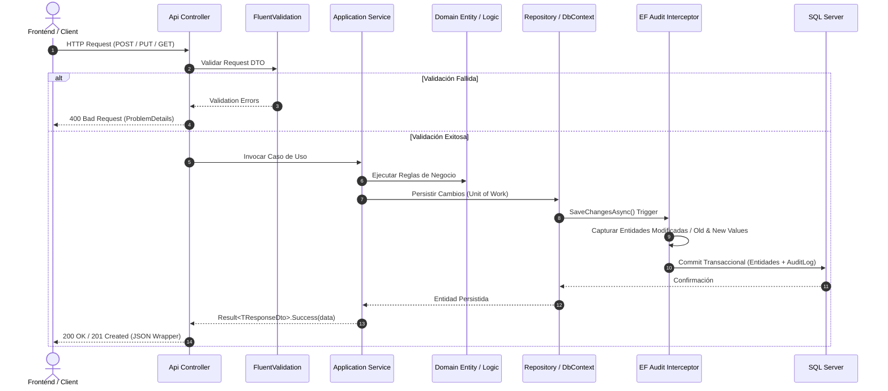

# 🏛️ ARQUITECTURA DEL SISTEMA — SISTEMA INTEGRAL DE GESTIÓN PORCINA

## 1. Visión General del Sistema
El **Sistema Integral de Gestión para una Granja Porcina** es una plataforma empresarial diseñada para administrar, monitorear y optimizar de punta a punta las operaciones zootécnicas, reproductivas, sanitarias, nutricionales, inventario, financieras y de trazabilidad en granjas porcinas de ciclo completo, sitios múltiples o granjas de cría/engorde.

El sistema está construido bajo principios de **Clean Architecture**, alta modularidad, desacoplamiento estricto y trazabilidad inmutable de eventos.

---

## 2. Principios Arquitectónicos
1. **Clean Architecture / Onion Architecture**: El dominio y las reglas de negocio no dependen de bases de datos, librerías externas o frameworks de presentación.
2. **Feature-Driven Frontend**: Frontend modularizado por funcionalidades de negocio con aislamiento de componentes, hooks, esquemas y llamadas a API.
3. **Trazabilidad Inmutable**: Los movimientos de animales, cambios de lote, pesajes, partos, tratamientos y consumos generan eventos históricos que nunca se sobreescriben.
4. **Configurabilidad Operativa**: No se asumen reglas biológicas o contables fijas; los umbrales zootécnicos y métodos de costeo se parametrizan por granja.
5. **Auditoría Transversal Automática**: Todo cambio en entidades críticas (`CREATE`, `UPDATE`, `DELETE`, `VOID`) se registra mediante interceptores a nivel de persistencia.

---

## 3. Arquitectura del Backend (.NET 8 Web API)

```
SistemaGranja.sln
│
├── src/
│   ├── Api/                     # Punto de entrada HTTP, Middlewares, DI, Swagger, Controllers
│   │   ├── Controllers/         # Controladores REST delgados (Thin Controllers)
│   │   ├── Middlewares/         # Manejo global de excepciones, auditoría contextual
│   │   ├── Filters/             # Filtros de acción y autorización
│   │   └── Program.cs           # Configuración de servicios y pipeline HTTP
│   │
│   ├── Application/             # Casos de uso, Orquestación, DTOs, Validaciones
│   │   ├── Common/              # Interfaces, Modelos de respuesta (Result), Paginación
│   │   ├── Interfaces/          # Contratos de repositorios y servicios externos
│   │   └── Modules/             # Servicios de aplicación y DTOs por módulo
│   │       ├── Auth/
│   │       ├── FarmStructure/
│   │       ├── Pigs/
│   │       └── ...
│   │
│   ├── Domain/                  # Núcleo puro del negocio (Sin dependencias externas)
│   │   ├── Common/              # BaseEntity, IAuditableEntity, ISoftDeletable
│   │   ├── Entities/            # Entidades de dominio con comportamiento rico
│   │   ├── Enums/               # Enumeraciones del dominio
│   │   ├── ValueObjects/        # Objetos de valor inmutables
│   │   └── Exceptions/          # Excepciones de dominio
│   │
│   ├── Infrastructure/          # Implementación técnica y persistencia
│   │   ├── Persistence/         # EF Core DbContext, Mapeos Fluent API, Migraciones
│   │   │   ├── ApplicationDbContext.cs
│   │   │   ├── Configurations/  # Mapeos por entidad (IEntityTypeConfiguration)
│   │   │   └── Interceptors/    # Auditoría automática y Soft-Delete
│   │   ├── Repositories/        # Implementaciones de repositorios
│   │   ├── Identity/            # Servicios JWT, Hasheo Argon2/BCrypt
│   │   └── Services/            # Integraciones externas, generación de archivos
│   │
│   └── Shared/                  # Clases compartidas transversales
│       ├── Constants/           # Constantes del sistema, roles, permisos
│       ├── Helpers/             # Utilidades de fecha, cálculo zootécnico
│       └── Results/             # Result Pattern (Result, Result<T>, Error)
│
└── tests/
    ├── UnitTests/               # Pruebas unitarias de Dominio y Aplicación
    └── IntegrationTests/        # Pruebas de integración con InMemory / WebApplicationFactory
```

### Flujo de Ejecución Backend


---

## 4. Arquitectura del Frontend (React + Vite + TypeScript)

```
frontend/
├── src/
│   ├── app/                     # Configuración principal, Router y Providers
│   │   ├── App.tsx
│   │   ├── router.tsx           # Definición de rutas protegidas y públicas
│   │   └── providers.tsx        # QueryClientProvider, AuthProvider, FarmProvider
│   │
│   ├── components/              # Componentes visuales reutilizables
│   │   ├── ui/                  # Button, Input, Select, Modal, Table, Badge, Card, Spinner
│   │   ├── feedback/            # ConfirmDialog, Toast, EmptyState, ErrorBoundary
│   │   └── navigation/          # Breadcrumbs, Pagination, Tabs
│   │
│   ├── layouts/                 # Plantillas de estructura
│   │   ├── MainLayout.tsx       # Sidebar, Header contextual, Granja activa, User Menu
│   │   └── AuthLayout.tsx       # Layout para Login / Recuperación
│   │
│   ├── features/                # Módulos encapsulados por dominio
│   │   ├── auth/                # Login, Recuperación, Hook de sesión
│   │   ├── farm-structure/      # Gestión de Granjas, Áreas, Galpones, Corrales
│   │   ├── pigs/                # Ficha del animal, Genealogía, Trazabilidad
│   │   ├── batches/             # Lotes, Movimientos grupales
│   │   ├── reproduction/        # Celos, Montas/Inseminaciones, Gestaciones
│   │   ├── maternity/           # Partos, Camadas, Adopciones, Destetes
│   │   ├── weighings/           # Pesajes individuales/lote, Curvas de crecimiento
│   │   ├── health/              # Fármacos, Tratamientos, Vacunaciones, Retiros
│   │   ├── mortality/           # Registro de bajas, Causas, Necropsias
│   │   ├── feed/                # Dietas, Raciones, Fórmulas, Consumos
│   │   ├── inventory/           # Stock, Kardex, Movimientos multialmacén
│   │   ├── purchases/           # Proveedores, Órdenes de Compra, Recepciones
│   │   ├── sales/               # Clientes, Pesaje de salida, Facturación/Guías
│   │   ├── costs/               # Costo por kg producido, Centros de costo
│   │   ├── dashboard/           # KPIs zootécnicos, Alertas operativas, Gráficos
│   │   ├── reports/             # Generador y exportador (PDF, Excel, CSV)
│   │   └── audit/               # Visor y filtros de trazabilidad y auditoría
│   │
│   ├── hooks/                   # Custom Hooks transversales (useDebounce, usePermission)
│   ├── services/                # Cliente Axios base con interceptores de Token y Granja
│   ├── types/                   # Tipos globales, Paginación, Filtros comunes
│   ├── utils/                   # Formateadores (fechas, monedas, pesos, métricas)
│   └── lib/                     # Configuración de librerías (Axios, TanStack Query)
```

---

## 5. Aspectos Transversales (Cross-Cutting Concerns)

### 5.1. Seguridad y Autorización
* **Autenticación:** Tokens JWT (JSON Web Tokens) firmados con clave simétrica `HMAC-SHA256`, con tiempo de expiración configurable y mecanismo de *Refresh Token* seguro.
* **Control de Acceso:** Basado en Roles y Permisos granulares (`RBAC` + `PBAC`). Ejemplo de permisos: `pigs:create`, `pigs:read`, `pigs:update`, `pigs:delete`, `weighing:create`, `financial:read`.
* **Contexto Multi-Granja:** El usuario opera bajo una cabecera HTTP `X-Farm-Id`. Todas las consultas se filtran automáticamente por la granja activa mediante *Global Query Filters* en EF Core.

### 5.2. Manejo de Errores y Result Pattern
* Las capas de servicio retornan objetos `Result<T>` en lugar de lanzar excepciones para flujos de negocio controlados.
* Las excepciones no controladas se capturan en `ExceptionHandlingMiddleware`, retornando respuestas estructuradas bajo el estándar **RFC 7807 (ProblemDetails)**.

### 5.3. Auditoría Automática y Eliminación Lógica
* **Auditoría Transversal:** Interceptor en EF Core (`AuditSaveChangesInterceptor`) intercepta `ChangeTracker`, serializa `OldValues` y `NewValues` en JSON, e inserta en la tabla `AuditLogs` dentro de la misma transacción.
* **Soft Delete:** Las entidades críticas implementan `ISoftDeletable`. Las operaciones `DELETE` son convertidas por interceptor a actualizaciones con `IsDeleted = true` y `DeletedAt = DateTime.UtcNow`.
