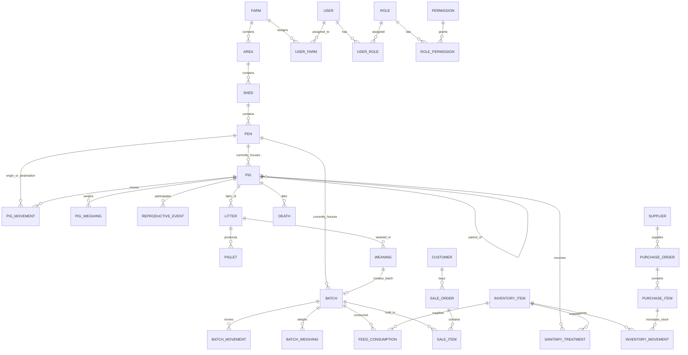

# 🗄️ MODELO DE BASE DE DATOS — SISTEMA DE GESTIÓN PORCINA

## 1. Convenciones y Estándares
* **Motor:** Microsoft SQL Server 2022+ / Azure SQL Database.
* **Nomenclatura de Tablas:** Plural en inglés, estilo PascalCase (`Farms`, `Pigs`, `Batches`, `SanitaryTreatments`).
* **Nomenclatura de Columnas:** PascalCase (`Id`, `IdentificationCode`, `CreatedAt`, `IsDeleted`).
* **Llaves Primarias (PK):** `Id UNIQUEIDENTIFIER` (Guid secuencial / NewSequentialId) o `BIGINT IDENTITY(1,1)` según criticidad. Se estandariza `Guid` para permitir generación descentralizada y alta escalabilidad.
* **Llaves Foráneas (FK):** `[EntidadSingular]Id` (ej. `FarmId`, `AreaId`, `PigId`).
* **Comportamiento en Eliminación:** `ON DELETE NO ACTION` / `RESTRICT` para preservar la trazabilidad e historial zootécnico. Las bajas se gestionan vía **Soft Delete** (`IsDeleted = 1`).
* **Auditoría Base:** Toda tabla transaccional o maestra hereda:
  * `CreatedAt DATETIME2 NOT NULL DEFAULT SYSUTCDATETIME()`
  * `CreatedBy VARCHAR(100) NOT NULL`
  * `UpdatedAt DATETIME2 NULL`
  * `UpdatedBy VARCHAR(100) NULL`
  * `IsDeleted BIT NOT NULL DEFAULT 0`
  * `DeletedAt DATETIME2 NULL`
  * `DeletedBy VARCHAR(100) NULL`

---

## 2. Diagrama Entidad-Relación Principal (Core y Operación)



---

## 3. Diccionario de Datos por Módulos

### 3.1. Núcleo de Granja y Topología Física

#### `Farms` (Granjas)
| Columna | Tipo | Nulo | Descripción |
| :--- | :--- | :---: | :--- |
| `Id` | `UNIQUEIDENTIFIER` | NO | Clave primaria |
| `Code` | `VARCHAR(50)` | NO | Código único de granja (Índice Único) |
| `Name` | `NVARCHAR(150)` | NO | Nombre oficial de la granja |
| `LegalName` | `NVARCHAR(200)` | SÍ | Razón social de la empresa propietaria |
| `TaxId` | `VARCHAR(50)` | SÍ | Identificador fiscal / RUT / RFC / NIF |
| `Location` | `NVARCHAR(250)` | SÍ | Dirección física / Coordenadas |
| `TotalCapacity` | `INT` | NO | Capacidad máxima teórica de animales |
| `IsActive` | `BIT` | NO | 1 = Activa, 0 = Inactiva |
| *Campos Auditoría* | ... | ... | CreatedAt, CreatedBy, UpdatedAt, etc. |

#### `Areas` (Áreas de Producción)
*Representa las divisiones macro de la granja (ej. Reproducción, Gestación, Maternidad, Destete/Transición, Engorde/Cebo, Cuarentena).*
| Columna | Tipo | Nulo | Descripción |
| :--- | :--- | :---: | :--- |
| `Id` | `UNIQUEIDENTIFIER` | NO | Clave primaria |
| `FarmId` | `UNIQUEIDENTIFIER` | NO | FK a `Farms` |
| `Code` | `VARCHAR(50)` | NO | Código del área dentro de la granja |
| `Name` | `NVARCHAR(100)` | NO | Nombre del área |
| `AreaType` | `INT` | NO | Enum: 1=GiltDevelopment, 2=Gestation, 3=Maternity, 4=Nursery, 5=Finishing, 6=Quarantine |
| `Description` | `NVARCHAR(500)` | SÍ | Observaciones o notas operativas |
| `IsActive` | `BIT` | NO | Estado del área |

#### `Sheds` (Galpones / Naves)
*Estructuras físicas techadas dentro de un área.*
| Columna | Tipo | Nulo | Descripción |
| :--- | :--- | :---: | :--- |
| `Id` | `UNIQUEIDENTIFIER` | NO | Clave primaria |
| `AreaId` | `UNIQUEIDENTIFIER` | NO | FK a `Areas` |
| `Code` | `VARCHAR(50)` | NO | Código del galpón |
| `Name` | `NVARCHAR(100)` | NO | Nombre del galpón |
| `VentilationType`| `INT` | NO | Enum: 1=Natural, 2=Tunnel, 3=NegativePressure |
| `TotalCapacity` | `INT` | NO | Capacidad máxima de animales |
| `IsActive` | `BIT` | NO | Estado operativo |

#### `Pens` (Corrales / Jaulas / Salas)
*Unidad mínima de alojamiento físico donde se ubican cerdos o lotes.*
| Columna | Tipo | Nulo | Descripción |
| :--- | :--- | :---: | :--- |
| `Id` | `UNIQUEIDENTIFIER` | NO | Clave primaria |
| `ShedId` | `UNIQUEIDENTIFIER` | NO | FK a `Sheds` |
| `Code` | `VARCHAR(50)` | NO | Código identificador del corral o jaula |
| `PenType` | `INT` | NO | Enum: 1=IndividualGestationCrate, 2=FarrowingCrate, 3=GroupPen, 4=BoarPen, 5=HospitalPen |
| `MaxCapacity` | `INT` | NO | Capacidad máxima permitida de animales |
| `CurrentOccupancy` | `INT` | NO | Cantidad actual de animales en el corral |
| `DimensionsM2` | `DECIMAL(8,2)` | SÍ | Área en metros cuadrados |
| `Status` | `INT` | NO | Enum: 1=Empty, 2=Occupied, 3=Maintenance, 4=Sanitizing |
| `IsActive` | `BIT` | NO | Estado de disponibilidad |

---

### 3.2. Seguridad, Usuarios y Control de Acceso

#### `Users` (Usuarios)
| Columna | Tipo | Nulo | Descripción |
| :--- | :--- | :---: | :--- |
| `Id` | `UNIQUEIDENTIFIER` | NO | Clave primaria |
| `Username` | `VARCHAR(50)` | NO | Nombre de usuario único |
| `Email` | `VARCHAR(150)` | NO | Correo electrónico único |
| `PasswordHash` | `VARCHAR(500)` | NO | Hash de contraseña con salt seguro |
| `FirstName` | `NVARCHAR(100)` | NO | Nombre(s) |
| `LastName` | `NVARCHAR(100)` | NO | Apellido(s) |
| `Phone` | `VARCHAR(30)` | SÍ | Teléfono de contacto |
| `IsActive` | `BIT` | NO | 1 = Activo, 0 = Inactivo / Bloqueado |
| `LastLoginAt` | `DATETIME2` | SÍ | Fecha y hora del último acceso |

#### `Roles` y `Permissions`
* `Roles`: `Id`, `Name` (Administrador, Gerente, Veterinario, Producción, Almacén, Ventas, Operario), `Description`, `IsSystemRole`.
* `Permissions`: `Id`, `Code` (ej. `animals:view`, `animals:create`, `medications:administer`, `costs:view`), `Module`, `Description`.
* `UserRoles`: `UserId`, `RoleId`.
* `RolePermissions`: `RoleId`, `PermissionId`.
* `UserFarms`: `UserId`, `FarmId`, `IsDefault` (Asignación de usuarios a granjas autorizadas).
* `RefreshTokens`: `Id`, `UserId`, `Token`, `ExpiresAt`, `IsRevoked`, `ReplacedByToken`.

---

### 3.3. Auditoría del Sistema

#### `AuditLogs`
| Columna | Tipo | Nulo | Descripción |
| :--- | :--- | :---: | :--- |
| `Id` | `UNIQUEIDENTIFIER` | NO | PK |
| `UserId` | `VARCHAR(100)` | SÍ | ID o identificador del usuario actor |
| `UserName` | `NVARCHAR(150)` | SÍ | Nombre de usuario en el momento de la acción |
| `FarmId` | `UNIQUEIDENTIFIER` | SÍ | Granja donde ocurrió el evento |
| `Action` | `VARCHAR(50)` | NO | `CREATE`, `UPDATE`, `DELETE`, `VOID`, `LOGIN`, `LOGOUT` |
| `Module` | `VARCHAR(100)` | NO | Módulo afectado (ej. `FarmStructure`, `Pigs`, `Health`) |
| `EntityName` | `VARCHAR(100)` | NO | Nombre de la entidad C# / Tabla |
| `EntityId` | `VARCHAR(100)` | NO | Clave primaria del registro intervenido |
| `OldValues` | `NVARCHAR(MAX)`| SÍ | JSON con el estado anterior |
| `NewValues` | `NVARCHAR(MAX)`| SÍ | JSON con el nuevo estado |
| `ChangedColumns` | `NVARCHAR(MAX)`| SÍ | Lista de columnas afectadas |
| `IpAddress` | `VARCHAR(50)` | SÍ | Dirección IP de origen |
| `UserAgent` | `NVARCHAR(500)` | SÍ | Navegador / Dispositivo |
| `Timestamp` | `DATETIME2` | NO | Fecha y hora UTC del evento |

---

### 3.4. Plantel Porcino, Lotes y Trazabilidad

#### `Pigs` (Animales / Plantel)
| Columna | Tipo | Nulo | Descripción |
| :--- | :--- | :---: | :--- |
| `Id` | `UNIQUEIDENTIFIER` | NO | PK |
| `FarmId` | `UNIQUEIDENTIFIER` | NO | Granja propietaria |
| `IdentificationCode` | `VARCHAR(50)` | NO | Arete / Tatuaje / Microchip (Índice Único por Granja) |
| `ElectronicId` | `VARCHAR(50)` | SÍ | RFID / Chip electrónico |
| `Sex` | `INT` | NO | Enum: 1=Female (Cerda/Primeriza), 2=Male (Verraco), 3=CastratedMale (Cebón) |
| `Breed` | `NVARCHAR(100)` | NO | Raza o línea genética (ej. Landrace, Large White, Pietrain, Camborough) |
| `GeneticLine` | `NVARCHAR(100)` | SÍ | Línea genética comercial |
| `BirthDate` | `DATE` | NO | Fecha de nacimiento |
| `EntryDate` | `DATE` | NO | Fecha de ingreso a la granja |
| `EntryType` | `INT` | NO | Enum: 1=BornInFarm, 2=Purchased, 3=Transferred |
| `SireId` | `UNIQUEIDENTIFIER` | SÍ | FK a `Pigs` (Padre) |
| `DamId` | `UNIQUEIDENTIFIER` | SÍ | FK a `Pigs` (Madre) |
| `CurrentPenId` | `UNIQUEIDENTIFIER` | SÍ | FK a `Pens` (Ubicación física actual) |
| `CurrentBatchId` | `UNIQUEIDENTIFIER` | SÍ | FK a `Batches` (Lote asignado si aplica) |
| `Status` | `INT` | NO | Enum: 1=Active, 2=Sold, 3=Dead, 4=Culled, 5=Transferred |
| `ReproductiveStatus`| `INT` | NO | Enum: 1=Gilt, 2=Open, 3=Inseminated, 4=Pregnant, 5=Lactating, 6=Dry |
| `Parity` | `INT` | NO | Número de partos acumulados |
| `ExitDate` | `DATE` | SÍ | Fecha de baja |
| `ExitReason` | `INT` | SÍ | Motivo de baja (Configurable) |
| `Notes` | `NVARCHAR(1000)`| SÍ | Observaciones zootécnicas |

#### `Batches` (Lotes)
| Columna | Tipo | Nulo | Descripción |
| :--- | :--- | :---: | :--- |
| `Id` | `UNIQUEIDENTIFIER` | NO | PK |
| `FarmId` | `UNIQUEIDENTIFIER` | NO | FK a `Farms` |
| `Code` | `VARCHAR(50)` | NO | Código del lote (ej. `LOT-2026-W38`) |
| `Name` | `NVARCHAR(150)` | NO | Nombre descriptivo del lote |
| `Stage` | `INT` | NO | Enum: 1=Lactation, 2=Nursery, 3=Grower, 4=Finisher, 5=ReplacementGilt |
| `StartDate` | `DATE` | NO | Fecha de apertura del lote |
| `EndDate` | `DATE` | SÍ | Fecha de cierre / liquidación |
| `InitialQuantity` | `INT` | NO | Cantidad inicial de cerdos ingresados |
| `CurrentQuantity` | `INT` | NO | Cantidad viva actual en el lote |
| `CurrentPenId` | `UNIQUEIDENTIFIER` | SÍ | FK a `Pens` |
| `InitialWeightKg` | `DECIMAL(10,2)` | SÍ | Peso total al ingreso |
| `Status` | `INT` | NO | Enum: 1=Active, 2=Closed, 3=Transferred, 4=Sold |

#### `PigMovements` / `BatchMovements` (Historial Inmutable de Ubicaciones)
* `Id`, `PigId` / `BatchId`, `SourcePenId`, `TargetPenId`, `MovementDate`, `Reason`, `ResponsibleUserId`, `Notes`, `CreatedAt`.

#### `PigWeighings` / `BatchWeighings` (Pesajes y Rendimiento)
* `Id`, `PigId` / `BatchId`, `WeighingDate`, `WeightKg`, `AgeDays`, `Stage`, `AverageDailyGainGrams` (Calculado), `ResponsibleUserId`, `Notes`.

---

### 3.5. Reproducción y Maternidad

#### `ReproductiveEvents` (Celos, Montas, Inseminaciones, Diagnósticos)
* `Id`, `PigId` (Hembra), `BoarId` (Macho/Semen), `EventType` (1=HeatDetection, 2=NaturalService, 3=ArtificialInsemination, 4=PregnancyCheck, 5=Abortion), `EventDate`, `Result` (Positive, Negative, Doubtful), `EstimatedFarrowingDate` (Calculada), `TechnicianUserId`, `Notes`.

#### `Litters` (Partos y Camadas)
* `Id`, `DamId` (Madre), `SireId` (Padre/Semen), `FarrowingDate`, `PenId` (Sala de parto), `TotalBorn`, `BornAlive`, `Stillborn` (Nacidos muertos), `Mummified` (Momias), `TotalBirthWeightKg`, `AverageBirthWeightKg`, `Status` (Lactating, Weaned, Closed).

#### `Weanings` (Destete)
* `Id`, `LitterId`, `WeaningDate`, `WeanedPigletsCount`, `TotalWeaningWeightKg`, `AverageWeightKg`, `TargetBatchId` (Lote de destino en transición/nursery), `ResponsibleUserId`.

---

### 3.6. Sanidad, Fórmulas, Inventario y Finanzas
* **Sanidad:** `Diseases`, `Medications`, `SanitaryTreatments`, `Vaccinations`, `WithdrawalPeriods` (Control estricto de días de retiro para no despachar carne con trazas de fármacos).
* **Mortalidad:** `Deaths` (AnimalId/BatchId, DeathDate, CauseId, NecropsyFindings, PenId, LossValue).
* **Alimentación & Inventario:** `FeedFormulas`, `FeedConsumptions`, `InventoryItems`, `InventoryMovements` (Entradas, Salidas, Ajustes, Kardex con costo promedio/FIFO).
* **Compras & Ventas:** `Suppliers`, `PurchaseOrders`, `PurchaseItems`, `Customers`, `SalesOrders`, `SaleItems` (Descuento automático de inventario o rebaño).
* **Costos:** `CostCenters`, `CostEntries` (Asignación de costos directos e indirectos por kg o lote).
* **Configuraciones:** `FarmConfigurations` (Claves de negocio parametrizables por granja).

---

## 4. Estrategia de Índices y Rendimiento
1. **Índices Únicos Filtrados:**
   ```sql
   CREATE UNIQUE NONCLUSTERED INDEX IX_Pigs_IdentificationCode_FarmId 
   ON Pigs(IdentificationCode, FarmId) 
   WHERE IsDeleted = 0;
   ```
2. **Índices de Búsqueda y Trazabilidad:**
   * Índices en `(FarmId, CurrentPenId)` en `Pigs` y `Batches`.
   * Índices en `(PigId, MovementDate DESC)` en `PigMovements`.
   * Índices en `(DamId, FarrowingDate DESC)` en `Litters`.
   * Índices en `(BatchId, WeighingDate DESC)` en `BatchWeighings`.
3. **Índices de Auditoría:**
   * Índices compuestos en `AuditLogs(EntityName, EntityId, Timestamp DESC)` y `AuditLogs(FarmId, Timestamp DESC)`.
